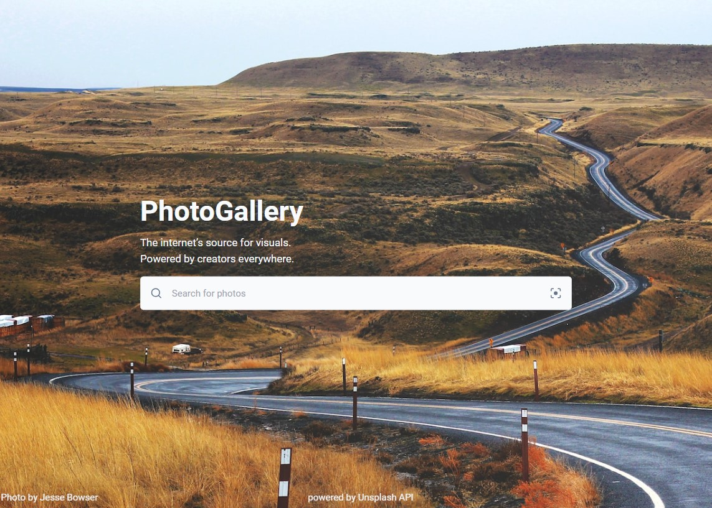
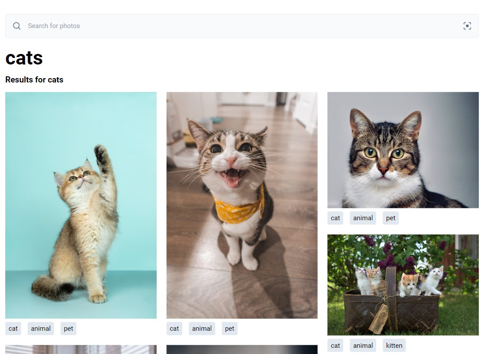

### (still working on refactoring the code and adding funcionalities)

# PhotoGallery

#### Project description:

- photo search powered by [Unsplash API](https://unsplash.com/documentation)
- navigation built with React Router 6 
- fetching photos in loader
- styled with Tailwind CSS
- built with: 

#### Project screenshots:

 
 
